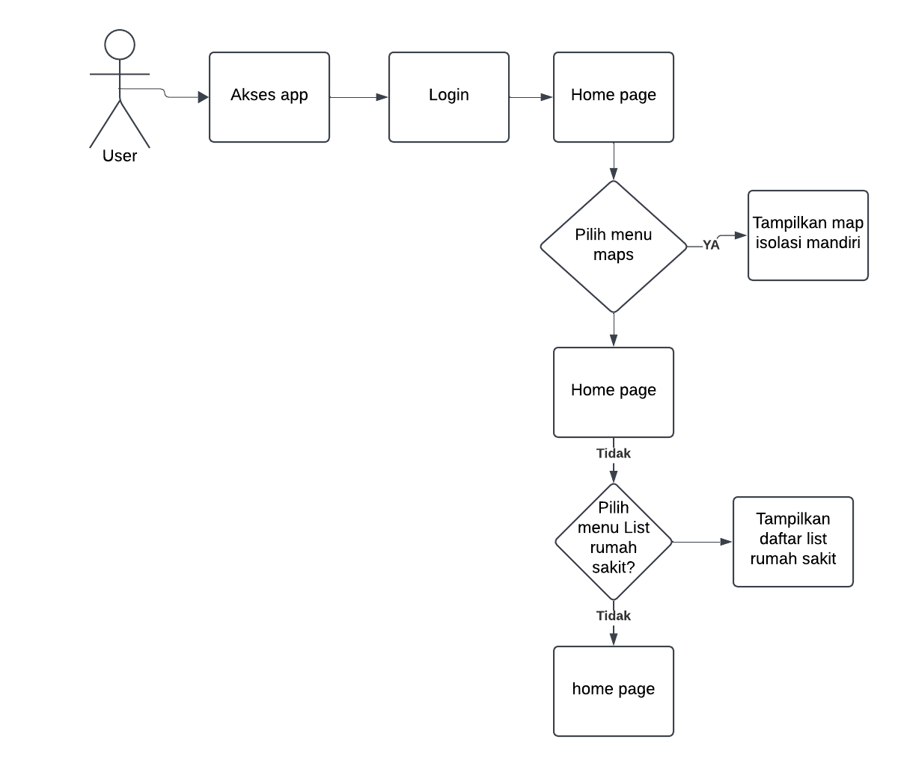

Nama : Charderra Eka Bagas Sanjaya

Nim : 20210801088

UTS Pemob tracking lokasi isolasi mandiri

# Mobile Apps Tracking Data Lokasi Isolasi Mandiri

Aplikasi Tracking Data Lokasi Layanan Isolasi Mandiri adalah sebuah sistem yang dirancang untuk memantau dan mencatat lokasi pengguna atau pasien yang menjalani isolasi mandiri, terutama dalam konteks penyebaran penyakit menular. Aplikasi ini memungkinkan pemantauan real-time terhadap pergerakan dan lokasi pasien yang diwajibkan untuk tetap di tempat isolasi yang ditentukan. Dengan aplikasi ini, pihak berwenang atau penyedia layanan kesehatan dapat lebih mudah melacak kepatuhan terhadap aturan isolasi mandiri, mengidentifikasi kontak yang mungkin berisiko, dan memastikan ketersediaan layanan kesehatan seperti pengiriman obat atau kebutuhan lainnya.

## Business Requirement Definition

Jenis Layanan: Layanan Informasi Lokasi Isolasi Mandiri

Definisi:
Dalam situasi pandemi atau keadaan darurat kesehatan lainnya, kebutuhan akan informasi terkait layanan isolasi mandiri menjadi sangat penting. Namun, sering kali masyarakat menghadapi kesulitan dalam menemukan lokasi layanan isolasi mandiri yang sesuai dengan kebutuhan mereka. Hal ini disebabkan oleh kurangnya informasi yang terstruktur dan mudah diakses.
Untuk mengatasi masalah ini, diperlukan sebuah aplikasi mobile berbasis teknologi yang dapat memberikan informasi lengkap dan terorganisir mengenai lokasi layanan isolasi mandiri di Indonesia. Aplikasi ini dirancang untuk memudahkan masyarakat dalam mencari dan mendapatkan informasi terkait fasilitas isolasi mandiri, termasuk nama fasilitas, alamat, jumlah pasien, status ketersediaan, dan kontak yang dapat dihubungi. Dengan fitur pencarian berdasarkan lokasi atau nama fasilitas, pengguna dapat dengan mudah menemukan layanan yang sesuai.
Aplikasi ini diharapkan dapat menjadi solusi praktis dalam mendukung manajemen kesehatan masyarakat, terutama pada masa krisis kesehatan. Dengan antarmuka yang ramah pengguna dan fitur yang informatif, aplikasi ini bertujuan untuk memberikan pengalaman yang nyaman serta membantu masyarakat mendapatkan layanan isolasi mandiri dengan lebih efisien.

Abstrak:
Pada masa pandemi atau situasi darurat kesehatan lainnya, kebutuhan akan informasi layanan isolasi mandiri menjadi sangat penting bagi masyarakat. Namun, keterbatasan informasi sering kali menjadi kendala dalam menemukan layanan yang sesuai. Oleh karena itu, diperlukan sebuah aplikasi mobile yang dapat memberikan informasi terkait lokasi layanan isolasi mandiri di Indonesia.
Aplikasi ini dirancang untuk memudahkan masyarakat dalam mencari fasilitas isolasi mandiri berdasarkan lokasi atau nama fasilitas. Pengguna dapat mengakses informasi penting seperti nama fasilitas, alamat, jumlah pasien saat ini, status ketersediaan, dan kontak yang dapat dihubungi. Dengan antarmuka yang intuitif dan fitur yang lengkap, aplikasi ini bertujuan untuk memberikan solusi praktis dan efisien dalam mendukung kebutuhan layanan isolasi mandiri masyarakat.

## Penjelasan Fungsi 

Fungsi Teknis

1. List Layanan Isolasi Mandiri
Pada fitur ini berisi daftar layanan isolasi mandiri di Indonesia, yang mencakup nama fasilitas, alamat, jumlah pasien, status ketersediaan, dan kontak. Informasi disajikan dalam format yang terstruktur dan mudah dibaca untuk membantu pengguna memahami setiap layanan yang tersedia.

2. Detail Layanan
Pada fitur ini, pengguna dapat melihat informasi lebih lengkap tentang layanan isolasi mandiri. Informasi mencakup nama fasilitas, alamat, jumlah pasien saat ini, status ketersediaan, kontak, dan deskripsi singkat tentang layanan tersebut. Pengguna dapat mengakses fitur ini dengan memilih salah satu layanan dari daftar yang tersedia.

3. Pencarian Layanan
Pada fitur ini, pengguna dapat mencari layanan isolasi mandiri tertentu berdasarkan nama fasilitas atau lokasi. Fitur pencarian ini dirancang untuk memudahkan pengguna dalam menemukan layanan yang sesuai dengan kebutuhan mereka, dengan hasil pencarian yang relevan dan cepat.

Fungsi Strategis

1. Kinerja
Memberikan solusi bagi masyarakat yang kesulitan mencari informasi mengenai layanan isolasi mandiri di Indonesia dengan menyediakan data yang lengkap, akurat, dan mudah diakses.

2. Keunggulan
Aplikasi ini memiliki antarmuka yang intuitif dan ramah pengguna, dilengkapi dengan fitur pencarian yang efisien, sehingga pengguna dapat dengan mudah menemukan layanan isolasi mandiri yang sesuai dengan kebutuhan mereka.

## Proses Flow

- Pengguna membuka aplikasi dan dapat melihat seluruh daftar layanan isolasi mandiri yang tersedia.
- Pengguna dapat mencari layanan isolasi mandiri berdasarkan lokasi atau nama fasilitas.
- Sistem menampilkan daftar layanan isolasi mandiri yang sesuai dengan hasil pencarian.
- Pengguna dapat memilih salah satu layanan isolasi mandiri untuk melihat detail informasi.
- Sistem menampilkan informasi detail tentang layanan isolasi mandiri, termasuk nama fasilitas, alamat, jumlah pasien, status ketersediaan, dan kontak yang dapat dihubungi.
- Jika diperlukan, pengguna dapat menyalin atau menggunakan kontak untuk menghubungi layanan isolasi mandiri.
- Pengguna dapat kembali ke halaman utama untuk mencari atau melihat layanan lain.

## Diagram Flow

## Tech

- Flutter
- Open Street Map
- Firebase

## Penggunaan aplikasi

Note: Pada aplikasi tidak ada credentials, langsung tekan tombol login saja

1. Buka Terminal atau Command Prompt.

Navigasikan ke folder tempat Anda ingin menyimpan proyek dengan perintah:

cd path/ke/folder

Clone repository menggunakan perintah:

git clone https://github.com/username/repository_name.git

Tunggu proses selesai. Proyek akan diunduh ke folder baru dengan nama repository.

2. Masuk ke Folder Proyek

Pindah ke direktori proyek:
cd repository_name 

6. Jalankan Perintah Flutter

Jalankan perintah berikut untuk mengunduh semua dependensi proyek:

flutter pub get

Jika Anda menggunakan emulator atau perangkat fisik, pastikan perangkat tersebut sudah disiapkan dan jalankan perintah:

flutter run

## Screenshot hasil aplikasi 

  
  
  
  
  
  

